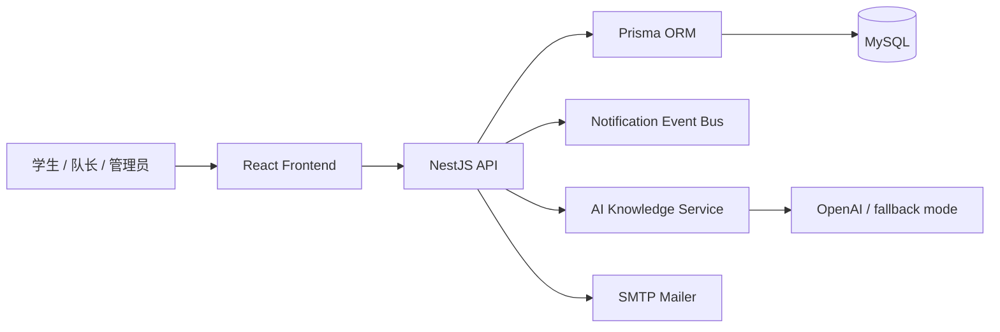

# SPEC.md

## 1. 项目问题陈述

本项目是一个面向校园场景的“学生组队报名与协作平台”，目标是让学生能够快速发布队伍、查找队友、管理任务、交流协作并在需要时接受后台审核与管理。项目核心价值在于：在校园活动、比赛、创新创业、项目实践等情境中，学生往往需要在短时间内形成团队，而现有的信息传播渠道分散且不适合真实协作管理。

系统解决的是“队伍组织、成员匹配、任务协作、通知与审核”的一体化问题。它面向的用户主要是学生、队长、管理员和组织方老师，覆盖组队、匹配、任务跟踪和通知管理的真实场景。

## 2. 用户故事

1. 作为学生，我希望能够发布自己的队伍需求，因此我能快速公开招募成员。
2. 作为队长，我希望能够查看候选者的能力标签和资料，因此我可以更准确地筛选队友。
3. 作为学生，我希望能够在队伍大厅中筛选和匹配项目目标相近的队伍，因此我可以减少无效沟通。
4. 作为队员，我希望能够在任务列表中了解当前工作分工，因此我能明确自己的责任。
5. 作为管理员，我希望查看申请、举报和违规记录，因此我能维护平台秩序。
6. 作为用户，我希望收到会话与任务通知，因此我能及时响应和推进协作。

这些故事均满足 INVEST 原则：独立、可协商、具有价值、可估算、可测试、足够小。

## 3. 功能规约

### 3.1 用户认证与授权
- 输入：邮箱、学生号、密码、验证码等。
- 行为：注册、登录、JWT 鉴权、邮箱验证切换。
- 输出：token、用户资料、状态码。
- 边界：密码必须哈希、token 仅在 HTTP 头中传输、邮箱验证可按配置启用。
- 错误处理：重复邮箱/学号、错误密码、未验证邮箱导致访问受限。

### 3.2 用户资料与技能管理
- 输入：昵称、学院、年级、专业、技能、可用时间。
- 行为：更新用户档案与技能标签。
- 输出：用户资料卡、可用时间表。
- 边界：技能标签必须经过约束枚举，防止无效值。
- 错误处理：非法字段、空值、超长内容。

### 3.3 队伍创建与加入
- 输入：队伍名、介绍、需求技能、人数上限、招募状态。
- 行为：创建队伍、生成唯一邀请码、申请加入、审批加入。
- 输出：队伍详情、成员列表、状态信息。
- 边界：未满足信誉分门槛不能创建/加入过多队伍。
- 错误处理：队伍已满、重复申请、非队长操作。

### 3.4 匹配与推荐
- 输入：用户技能、偏好、可用时间。
- 行为：筛选并推荐符合条件的队伍或成员。
- 输出：排序后的匹配结果。
- 边界：缺少技能/可用时间时退化为基础列表。
- 错误处理：空结果给出提示，不抛出错误。

### 3.5 任务与协作
- 输入：任务标题、描述、截止日期、责任人、状态。
- 行为：创建、更新、完成、提交反馈。
- 输出：任务列表、状态变化、责任分工。
- 边界：只有队长或允许的成员可变更任务状态。
- 错误处理：非法状态迁移、越权更新。

### 3.6 通知与消息
- 输入：事件类型、目标用户、内容。
- 行为：创建通知、事件驱动推送、WebSocket 消息。
- 输出：通知列表、未读计数、实时消息。
- 边界：通知必须支持异步事件总线。
- 错误处理：缺失目标用户时记录日志并忽略。

### 3.7 管理审核与信用体系
- 输入：举报、申诉、违约情况、信誉分调整。
- 行为：平台审核、信用扣减与恢复、状态变更。
- 输出：审核结果、用户信誉统计。
- 边界：审核操作需保留审计信息。
- 错误处理：无权审核的情况返回 403。

### 3.8 AI 工程知识模块
- 输入：仓库路径、项目名称和问题文本。
- 行为：分析项目结构、生成知识摘要、回答项目问题。
- 输出：项目档案、知识总结、问答结果、引用证据。
- 边界：未配置 API Key 时必须自动退回本地 fallback。
- 错误处理：上游调用失败时保留本地结果并记录原因。

## 4. 非功能性需求

### 性能
- API 常见查询应在 2 秒内返回；复杂列表在 5 秒内完成。
- WebSocket 通知应以低延迟推送，不阻塞主业务线程。

### 安全
- JWT secret 与 SMTP 密码、AI API Key 绝不写死在源码中。
- 使用 .env、系统凭据管理器或加密文件加载。
- 关键字段均在日志中脱敏，不回显明文。
- API 对异常输入进行校验和白名单控制。

### 可用性
- 本地启动需在 5 分钟内完成：数据库、后端、前端可一键启动。
- 根据配置支持邮箱验证关闭，以便开发环境更快测试。

### 可观测性
- 日志应覆盖认证、任务状态、通知发送、AI 调用失败与回退。
- 关键异常应输出到结构化日志，并注明用户和请求上下文。

## 5. 系统架构

前端：React + Vite，负责页面与状态管理。后端：NestJS + Prisma，负责业务逻辑、鉴权、CRUD、事件驱动通知。数据库：MySQL 8。外部依赖：OpenAI API（可选）和 SMTP。架构模式采用分层单体应用：controller -> service -> repository -> prisma。

## 6. 数据模型

核心实体：
- User：id、email、passwordHash、studentNo、role、verifiedAt。
- UserProfile：nickname、college、grade、availability、skills。
- Team：id、name、description、ownerId、requiredSkills、maxMembers、code。
- TeamMember：teamId、userId、status、joinedAt。
- Task：id、teamId、title、description、assigneeId、status。
- Notification：id、userId、type、content、readAt。
- AIProject / AI document / AIConversation：用于知识地图生成与项目问答。

关系：User - 1:N Team, Team - 1:N TeamMember, Team - 1:N Task, User - 1:N Notification.

## 7. 凭据与分发设计

### 凭据设计
- 首选：系统钥匙串 / 环境变量 + .env.example 模板。
- 运行时通过 .env 加载，不在终端命令行暴露。
- 对于 AI API Key，采用 `OPENAI_API_KEY` 与 `AI_CONFIG_MASTER_KEY` 两层保护，日志中仅保留 mask 后信息。
- 目标平台：本地开发机与 Docker 容器。
- 运行时首次录入：用户复制 `.env.example` 到 `.env`，按模板填写密钥；必要时在 README 中说明清楚风险。

### 分发形态
- 选用 Docker 容器分发，兼顾零基础人员可启动性。
- 运行方式：`docker compose up -d`，启动 MySQL；随后启动后端和前端。
- 目标平台：Linux/macOS/Windows（Docker Desktop）。
- 约束：需要 Docker Engine 与 Node 20+ / pnpm 9+ 环境；本地脚本使用 PowerShell 兼容性要求。

## 8. 技术选型与理由

- 后端：NestJS，适合面向实体 CRUD、鉴权、事件驱动通知、Swagger 接口文档。
- 前端：React + Vite，开发速度快、适合多页面应用。
- ORM：Prisma，类型安全、数据库迁移易于维护。
- 数据库：MySQL 8，稳定、适合校园运营规模。
- LLM：OpenAI GPT 系列（可选），用于 AI 知识总览与项目问答；未配置时自动回退本地生成逻辑。
- 分发：Docker Compose，便于一键运行与演示。

## 9. 验收标准

- 用户能成功注册、登录、填写资料与技能。
- 队长能创建队伍并生成唯一邀请码。
- 学生能申请加入队伍并在审批后进入成员列表。
- 用户能在任务中创建和更新任务状态。
- 用户能收到通知与 WebSocket 实时更新。
- 管理员能够审查申请或违规记录并执行信用调整。
- AI 模块在无 key 时不崩溃，且给出本地 fallback 说明。
- CI 中 unit-test job 可运行，且 Docker / Compose 可至少构建成功。

## 10. 风险与未决问题

- 邮件服务在开发和生产环境配置高度依赖，需严格隔离。
- AI 生成内容可能出现幻觉，因此必须保留 fallback 与 citations。
- WebSocket 与数据库事务在并发场景中需注意一致性。
- Docker 环境下 MySQL 和应用服务的端口和变量初始化需要标准化。

## 11. 结论

本项目满足真实应用类项目的要求：功能模块清晰、技术栈合理、可一键运行、具备凭据安全与分发方案，且为后续扩展保留了 AI 与事件驱动机制。它既能作为一个校园协作平台演示，又具备工程化的交付价值。 
