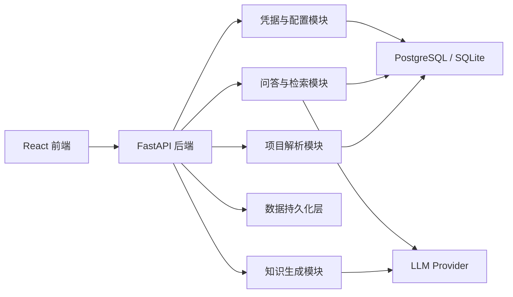

# 架构企划书

## 1. 架构目标
本项目的总体目标是构建一个“代码仓库知识地图生成器”，它能帮助用户快速理解一个陌生项目。系统需要具备以下能力：
- 支持导入一个项目目录；
- 解析项目结构与关键文件；
- 自动生成项目知识摘要；
- 支持基于项目内容进行问答；
- 对单人开发者而言，系统结构必须足够清晰，便于持续开发和维护。

本项目采用模块化单体架构，核心思路是：
- 前端负责交互；
- 后端负责业务逻辑；
- 数据库负责持久化；
- LLM 提供生成与问答能力；
- Docker 负责一键部署和演示。

## 2. 架构原则
1. 单人开发友好：避免过度复杂的服务拆分。
2. 功能分层清晰：解析、生成、问答、存储分离。
3. 支持 Docker：方便本地运行和演示。
4. 支持后续扩展：后期可接入 GitHub 仓库、向量数据库、更多生成模板。

## 3. 总体架构
系统采用“前端 + 后端 + 数据库 + LLM 服务”的分层构架。

## 4. 组件设计

### 4.1 前端层
前端提供用户交互入口，主要页面包括：
- 项目导入页面
- 项目摘要页面
- 问答页面
- 历史记录页面

前端职责：
- 收集用户输入；
- 调用后端接口；
- 展示解析结果、生成文档和问答结果。

技术栈：React + Vite + Tailwind。

### 4.2 后端服务层
后端是整个系统的核心，负责组织业务流程并协调各模块。

后端职责：
- 处理项目导入请求；
- 调用解析模块提取项目信息；
- 调用知识生成模块生成文档；
- 调用问答模块根据项目内容回答问题；
- 管理数据存储与配置。

技术栈：FastAPI + Pydantic。

### 4.3 项目解析模块
该模块负责读取用户提供的项目目录，并提取项目的基础信息。

功能包括：
- 读取文件夹结构；
- 识别 README、配置文件、package.json、pyproject.toml、requirements.txt 等；
- 提取关键代码文件路径；
- 生成结构化的项目摘要对象。

输入：项目目录路径

输出：
- 项目名称
- 项目类型
- 关键文件列表
- 目录结构摘要
- 关键配置摘要

### 4.4 知识生成模块
该模块负责把解析结果转为“人可读”的知识内容。

功能包括：
- 生成项目简介；
- 生成模块说明；
- 生成开发上手指南；
- 生成关键约束与风险提示。

该模块依赖 LLM 生成文本，但必须把输入限制在解析出的项目内容范围内，尽量降低幻觉。

### 4.5 问答与检索模块
该模块负责回答用户的问题。

功能包括：
- 读取项目内容与历史记录；
- 根据问题检索相关上下文；
- 将上下文和问题组装给 LLM；
- 返回结构化回答。

### 4.6 数据持久化层
用于保存系统的核心数据。

主要实体：
- Project：项目实例
- Document：生成文档
- Conversation：问答记录
- Config：凭据和配置项

数据库方案：
- MVP 可先使用 SQLite；
- 后续可升级为 PostgreSQL。

### 4.7 凭据与配置模块
职责：安全处理 LLM API Key。 

功能：
- 从环境变量读取密钥；
- 允许用户配置/更新/清除密钥状态；
- 不把密钥写入源码或日志。

## 5. 模块间关系
- 前端调用后端 API；
- 后端调用解析模块与生成模块；
- 解析结果和生成结果写入数据库；
- 问答模块从数据库和项目内容中读取上下文；
- LLM 只作为生成与问答引擎，不直接承担数据持久化。

## 6. 部署架构
系统建议通过 Docker Compose 部署，包含以下服务：
- frontend：React 前端容器
- backend：FastAPI 后端容器
- db：数据库容器

### 6.1 最小部署版本
- 1 个前端容器
- 1 个后端容器
- 1 个数据库容器

这已经足够支撑完整演示流程：导入项目 → 生成摘要 → 问答。

## 7. 数据模型

### 7.1 Project
字段：
- id
- name
- source_type
- source_path
- created_at

### 7.2 Document
字段：
- id
- project_id
- title
- doc_type
- content
- created_at

### 7.3 Conversation
字段：
- id
- project_id
- question
- answer
- created_at

### 7.4 Config
字段：
- id
- provider
- key_ref
- status
- updated_at

## 8. 关键业务流程

### 流程一：项目导入
1. 用户上传项目目录或输入路径；
2. 后端调用解析模块；
3. 解析模块提取目录结构与关键文件；
4. 结果保存到数据库并返回给前端。

### 流程二：知识摘要生成
1. 用户点击“生成摘要”；
2. 后端读取已导入项目内容；
3. 生成模块根据模板和上下文输出摘要；
4. 文档内容保存到数据库并在前端展示。

### 流程三：项目问答
1. 用户输入问题；
2. 后端检索相关项目内容和历史上下文；
3. 问答模块把上下文发送给 LLM；
4. 系统返回回答和引用信息。

## 9. 安全设计
- LLM Key 不写入源码；
- 通过环境变量或安全配置文件加载；
- 前端不直接暴露敏感配置；
- 日志中不输出明文密钥。

## 10. 测试策略
- 单元测试：测试解析逻辑、提示模板、摘要生成逻辑；
- 接口测试：测试导入、生成、问答等 API；
- 集成测试：测试前后端与数据库协同工作；
- 端到端测试：测试从上传项目到显示结果的完整流程。

## 11. 实施建议
建议按照以下顺序推进：
1. 先实现后端健康检查与 API 骨架；
2. 再完成项目解析与数据模型；
3. 再实现知识摘要生成；
4. 再实现问答功能；
5. 最后补 Docker、测试和 README。

## 12. 后续扩展方向
- 支持 GitHub / GitLab 仓库直接导入；
- 接入向量数据库提高检索能力；
- 支持更多生成模板，如“部署说明”“模块依赖图”; 
- 支持团队协作与权限控制。
